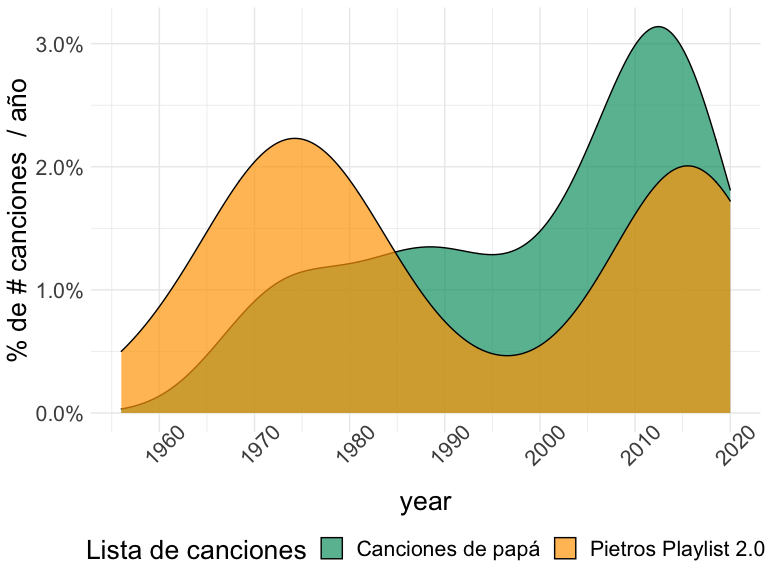
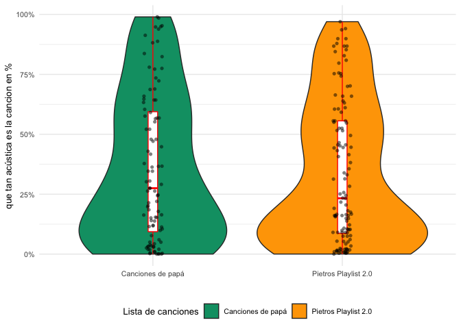
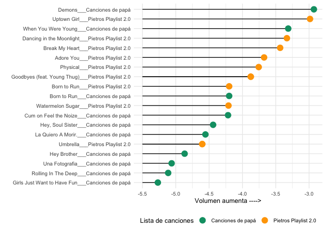
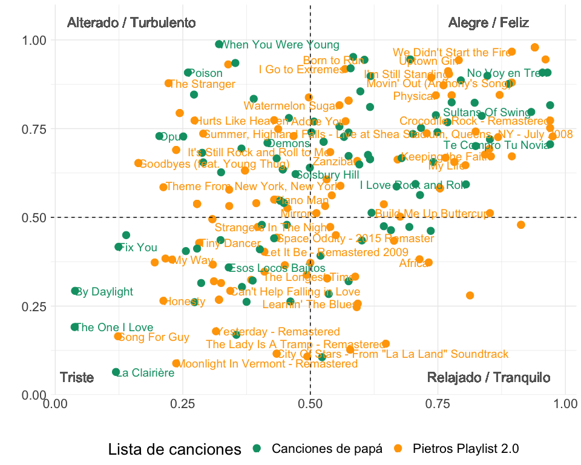

## Los participantes!!
 
<br>
<br>
  
## The libraries
  

```r
library(lubridate)
library(tidyverse)
library(Hmisc)
library(knitr)
library(janitor)
library(emo)
library(tidytext)
```

<br>
<br>

## tenemos dos listas de *Spotify* 

- Canciones de papá
- Pietros Playlist 2.0

<br>
<br>


## Vamos a responder algunas preguntas

<br>
Spotify nos permite analizar a través de su [API](https://developer.spotify.com/documentation/web-api/reference/tracks/get-audio-features/) varias medidas asociadas a cada canción. Nuestro reto los vamos a realizar comparando las diferentes métricas y utilizando el paquete [spotifyr]()
<br>

- Quien es el verdadero audiófilo retro ??
- nos gustan las versiones en acústico??
- quien monta mejor la fiesta??
- tenemos canciones alegres?? 
- quien molesta mas a los vecinos??
- vamos a comparar las listas en un gráfico que podemos resumir como energia contra humor (tomando la idea de [Rcharlie](http://rcharlie.net/sentify/))


<br>
<br>

## el premio del **ESPIRITU JOVEN** es para...


```r
battle_df<- readRDS("raw_data/2020_11_08_Pi_vs_dad.RDS")

battle_df <-  battle_df %>%  
  select(danceability, energy, loudness, mode, speechiness, acousticness, instrumentalness,
         liveness, valence, tempo, track.artists, track.album.release_date, playlist, track.name) %>% unnest(track.artists) %>% 
  rename(year = 
           track.album.release_date) %>% 
  mutate(year = str_sub(year , end = 4))

battle_df$year = as.integer(battle_df$year)

the_colors <- c("#009E73", "orange")

battle_df %>% 
  
  ggplot()+
  geom_density(aes(year, group = playlist, fill = playlist), alpha = 0.7)+
  theme_minimal()+
  theme(axis.text.x = element_text(angle = 45),
        text = element_text(size=20),legend.position = "bottom") +
  scale_y_continuous(labels = scales::percent_format())+
  scale_x_continuous(labels = seq(1950, 2020, 10),
                     breaks = seq(1950, 2020, 10)
                     )+
  scale_colour_manual(values = the_colors,
                      aesthetics = "fill") +
  labs(y = "% de # canciones  / año",
       fill = "Lista de canciones")
```

<!-- -->

### TENEMOS UN GANADOR!! uno de los dos tiene un  <span style="color:red"> *ALMA MUY JOVEN !!!* </span>  

<br>
<br>

## Versiones en acústico, a quién le gustan??


```r
battle_df %>% 
  
  ggplot()+
  # geom_density(aes(year, group = playlist, fill = playlist), alpha = 0.5)+
  geom_violin(aes(playlist, acousticness , fill = playlist))+
  geom_boxplot(aes(playlist, acousticness ), color="red", width = 0.05) +
  theme_minimal()+
   theme( text = element_text(size=10),legend.position = "bottom") +
  scale_y_continuous(labels = scales::percent_format()) +
  geom_jitter(aes(playlist, acousticness ),shape=16, position=position_jitter(0.05), alpha = 0.5) +
  scale_colour_manual(values = the_colors,
                      aesthetics = "fill")+
  labs(y = "que tan acústica es la cancion en %",
       x= "",
       fill = "Lista de canciones")
```

<!-- -->

### Esto es un empate técnico... quizas llamando al VAR?? 🧐 
<br>
<br>
<br>

##  Llego el momento de la rumba..!!
tenemos una medida en Spotify que, tomandonos una licencia, la traducimos al español como "bailabilidad"   


```r
battle_df %>% 
  group_by(playlist) %>% 
  arrange(desc(danceability) ) %>% 
  select(track.name, danceability) %>% 
  rename(Lista = "playlist",
         "título de la canción" = track.name,
         bailabilidad = danceability) %>% 
  distinct() %>% head(n=10) %>%
  janitor::clean_names() %>% 
  kable()
```


|lista                |titulo_de_la_cancion                          | bailabilidad|
|:--------------------|:---------------------------------------------|------------:|
|Canciones de papá    |Girls Like You (feat. Cardi B)                |        0.851|
|Canciones de papá    |El Venao                                      |        0.841|
|Canciones de papá    |Juana la Cubana                               |        0.833|
|Pietros Playlist 2.0 |Ob-La-Di, Ob-La-Da - Remastered 2009          |        0.818|
|Canciones de papá    |I Want You to Want Me                         |        0.806|
|Canciones de papá    |No Voy en Tren                                |        0.794|
|Pietros Playlist 2.0 |Keeping the Faith                             |        0.781|
|Canciones de papá    |Just Give Me a Reason (feat. Nate Ruess)      |        0.778|
|Canciones de papá    |Memories                                      |        0.764|
|Pietros Playlist 2.0 |Sunflower - Spider-Man: Into the Spider-Verse |        0.760|

### El <span style="color:blue50"> *TOP 10 de bailabilidad * </span> tiene un ganador!!!


<br>
<br>
<br>

## Vamos a buscar las canciones mas alegres  😄 


```r
battle_df %>% 
  
  ggplot()+
   geom_histogram(aes(valence, y= stat(width*density), group = playlist, fill = playlist), alpha = 0.7, bins = 10)+
  scale_colour_manual(values = the_colors,
                      aesthetics = "fill") +
  # geom_boxplot(aes(playlist, acousticness ), color="red", width = 0.05) +
  theme_minimal()+
   theme( text = element_text(size=10),legend.position = "bottom") +
  scale_y_continuous(labels = scales::percent_format()) +
  # geom_jitter(aes(playlist, acousticness ),shape=16, position=position_jitter(0.05), alpha = 0.5) +

  labs(y = " % de canciones / nivel de alegria",
       x=  "nivel de alegria --->",
       fill = "Lista de canciones")+ facet_wrap(~playlist)
```

<!-- -->

### Las canciones con mayoria de mensajes alegres y positivos van para nuestro  <span style="color:darkgreen">  participante mas joven !!! </span> 


<br>
<br>
<br>

## Loudness, lo podriamos traducir como "ruidoso??... hay canciones que solo tienen sentido a todo volumen  🎈 🎻 🥁 
 


```r
  # mutate(terms = reorder_within(terms, abs(value), component)) %>%


battle_df %>%
  mutate_if(is.character, factor) %>% 
  mutate(track.name = reorder_within(track.name, loudness, playlist)) %>% 
  group_by(playlist) %>% 
  top_n(10, loudness ) %>% 
  ungroup() %>% 
  # head(20) %>% 
  ggplot()+
  geom_segment(aes(x=track.name, xend=track.name, y=-5.5, yend= loudness ) ) +
   geom_point(aes(track.name, y= loudness,  color = playlist), alpha = 1, size = 4)+
 
  scale_colour_manual(values = the_colors,
                      aesthetics = "color") +
  # geom_boxplot(aes(playlist, acousticness ), color="red", width = 0.05) +
  theme_minimal()+
   theme( text = element_text(size=10),legend.position = "bottom") +
 


  labs(y = "Volumen aumenta ---->",
       x=  "",
       color = "Lista de canciones")+
  coord_flip()
```

<!-- -->

```r
# + facet_wrap(~playlist)
```

### Esos puntitos verdes de arriba no nos engañan.. tenemos claro a quien buscan los vecinos cuando llaman!!!

<br>
<br>
<br>

## la comparacion final!!
<br>
Este gráfico, muestra la relacion de dos medidas qwue se pueden asociar de una manera muy suelta a sensaciones (descritas en las esquinas), aqui hacemos una comparacion de como se ven estas dos listas en este interesante espacio.
<br>
<br>

```r
battle_df %>% 
  ggplot(aes(valence, energy, label = track.name, color = playlist))+
  scale_colour_manual(values = the_colors,
                      aesthetics = "color") +
  geom_point(size = 4)+
  geom_hline(yintercept = 0.5, linetype = "dashed") +
  geom_vline(xintercept = 0.5, linetype = "dashed") +
  geom_text(check_overlap = TRUE, hjust = "inward", size = 5)+
  theme_minimal()+
  theme(legend.position = "bottom",
        text = element_text(size=20))+
  geom_text(aes(x= 0.15, y = 1.05), size = 6, label = "Alterado / Turbulento", color = "grey40") +
  geom_text(aes(x= 0.85, y = 1.05), size = 6, label = "Alegre / Feliz", color = "grey40") +
  geom_text(aes(x= 0.85, y = 0.05), size = 6, label = "Relajado / Tranquilo", color = "grey40") +
  geom_text(aes(x= 0.05, y = 0.05), size = 6, label = "Triste  ", color = "grey40") +  
  
  labs(y = "",
       x=  "",
       color = "Lista de canciones")
```

<!-- -->


## interesante gráfico 
La cobertura es similar en ambas listas, aunque en el cuadrante de "Relajado y tranquilo no aparece Pietro por ninguna parte... *<span style="color:orange"> Los vecinos nos dicen que ellos eso ya lo sabian!! </span> *
