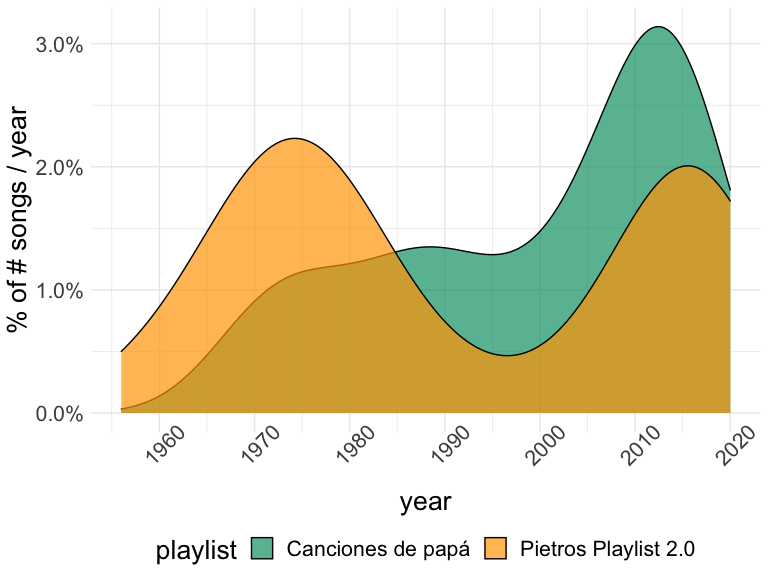
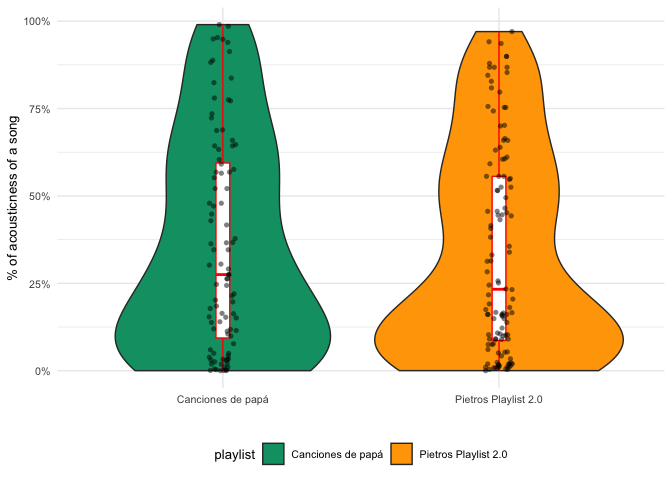
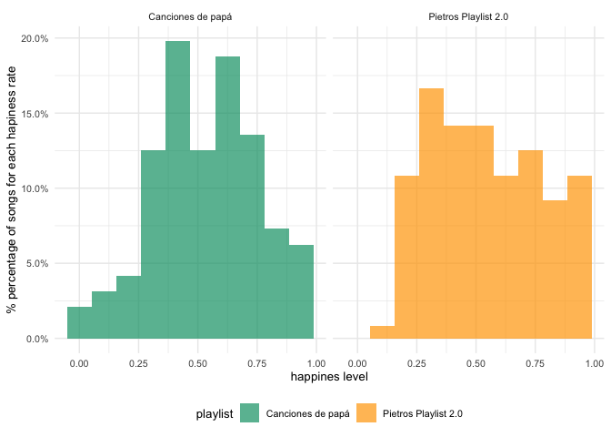
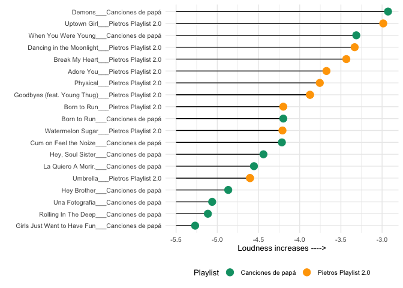

## The Players!!
 
<br>
<br>

## Two *Spotify* playlists

- Dad`s Beats
- Pietros Playlist 2.0

<br>
<br>


## We want to answer a few questions

<br>
Spotify presents in its API several measures associated to each track, we are basing our challenge in the comparison of this values.
<br>

- Who´s the retro lover here??
- Anyone for acoustic??
- Dance floor time
- are they happy songs?
- anyone annoying the neighbors??

<br>
<br>

## the True **YOUNG SPIRIT AWARD** goes to...

<!-- -->

### WELL WELL WELL!! someone has a very <span style="color:red"> *YOUNG SPIRIT* </span>  around here!!!

<br>
<br>

## We want to review who is more inclined towards acoustic music


<!-- -->

### This is a very close call... although a slight acousticness advantage goes to dad
<br>
<br>
<br>
<br>

##  party time, lets check their tools!!!
the higher the danceability score, the more likely the track will make people spin on a party!!!


|playlist             |track_name                                    | danceability|
|:--------------------|:---------------------------------------------|------------:|
|Canciones de papá    |Girls Like You (feat. Cardi B)                |        0.851|
|Canciones de papá    |El Venao                                      |        0.841|
|Canciones de papá    |Juana la Cubana                               |        0.833|
|Pietros Playlist 2.0 |Ob-La-Di, Ob-La-Da - Remastered 2009          |        0.818|
|Canciones de papá    |I Want You to Want Me                         |        0.806|
|Canciones de papá    |No Voy en Tren                                |        0.794|
|Pietros Playlist 2.0 |Keeping the Faith                             |        0.781|
|Canciones de papá    |Just Give Me a Reason (feat. Nate Ruess)      |        0.778|
|Canciones de papá    |Memories                                      |        0.764|
|Pietros Playlist 2.0 |Sunflower - Spider-Man: Into the Spider-Verse |        0.760|

### The <span style="color:blue50"> *TOP TEN DANCEABILITY* </span> has a winner!!!


<br>
<br>
<br>

## do we have happy 😄 songs??

<!-- -->

### The positive messages in the songs are clearly for our Young player!!! <span style="color:darkgreen"> *great theme choices!!!* </span> 


## Loudness is a classic, a loud track.. only makes sense with one volume!!!


```r
  # mutate(terms = reorder_within(terms, abs(value), component)) %>%


battle_df %>%
  mutate_if(is.character, factor) %>% 
  mutate(track.name = reorder_within(track.name, loudness, playlist)) %>% 
  group_by(playlist) %>% 
  top_n(10, loudness ) %>% 
  ungroup() %>% 
  # head(20) %>% 
  ggplot()+
  geom_segment(aes(x=track.name, xend=track.name, y=-5.5, yend= loudness ) ) +
   geom_point(aes(track.name, y= loudness,  color = playlist), alpha = 1, size = 4)+
 
  scale_colour_manual(values = the_colors,
                      aesthetics = "color") +
  # geom_boxplot(aes(playlist, acousticness ), color="red", width = 0.05) +
  theme_minimal()+
   theme( text = element_text(size=10),legend.position = "bottom") +
 


  labs(y = "Loudness increases ---->",
       x=  "",
       color = "Playlist")+
  coord_flip()
```

<!-- -->

```r
# + facet_wrap(~playlist)
```


